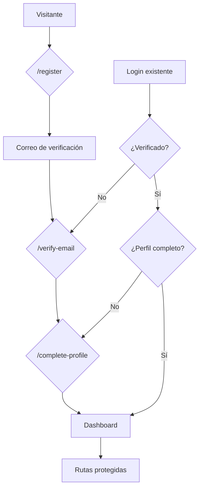
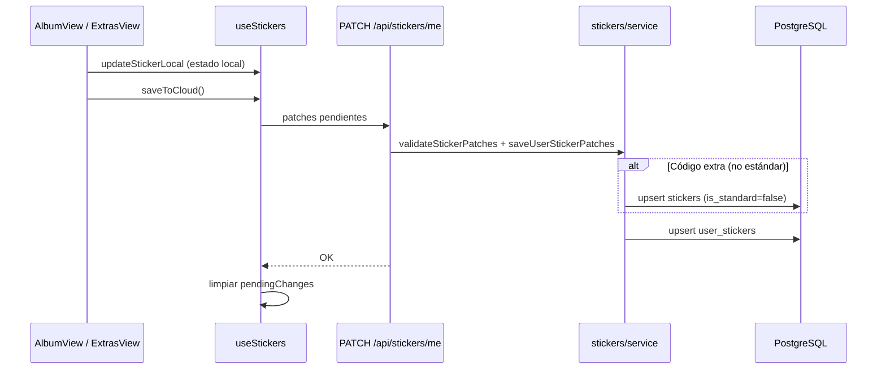
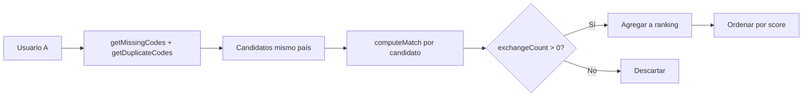
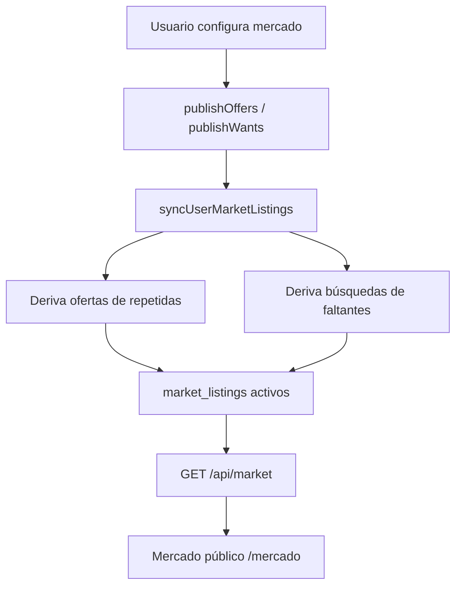

# Panini 2026 Tracker — Documentación del proyecto

> Idioma: español neutro (Perú).  
> Stack: Next.js 16 (App Router) · TypeScript · PostgreSQL · Prisma · Auth.js

---

## 1. Objetivo

**Panini Tracker** es una aplicación web para que coleccionistas del álbum Panini Mundial 2026 gestionen su colección, encuentren intercambios compatibles con otros usuarios y publiquen ofertas/demandas en un mercado público.

Reemplaza la versión original basada en Firebase (`intercambio-figuras-mundial` / [panini2026](https://github.com/eliparck-ai/panini2026)) con una arquitectura moderna, persistencia en PostgreSQL y funcionalidades ampliadas (mercado, reportes, admin).

### Objetivos concretos

| Objetivo | Descripción |
|----------|-------------|
| **Registrar colección** | Marcar figuritas pegadas, faltantes y repetidas del catálogo oficial (~1.000+ códigos). |
| **Medir avance** | Dashboard con porcentaje de completitud por sección (logo, especiales FWC, selecciones). |
| **Facilitar intercambios** | Match finder que cruza repetidas/faltantes con otros usuarios del mismo país. |
| **Mercado público** | Pantalla `/mercado` donde cualquier visitante ve ofertas y búsquedas publicadas por usuarios. |
| **Reportes imprimibles** | Reporte visual (mapa del álbum) y checklist para trueques presenciales. |
| **Extras promocionales** | Registrar figuritas fuera del catálogo estándar (promos, regionales). |
| **Administración** | Panel para admins con estadísticas y exportación CSV. |

---

## 2. Casos de uso

### UC-01 — Registro e ingreso

1. El usuario se registra con correo y contraseña (`/register`).
2. Verifica su correo mediante enlace (en dev se imprime en consola del servidor).
3. Completa perfil: nombre, apellido y país (`/complete-profile`).
4. Inicia sesión con credenciales o Google OAuth (opcional).

**Precondiciones:** ninguna.  
**Postcondiciones:** usuario verificado con perfil completo puede acceder a rutas protegidas.

### UC-02 — Gestionar álbum estándar

1. El usuario abre `/album` y navega por páginas del álbum.
2. Marca figuritas como pegadas o indica cantidad de repetidas.
3. Guarda cambios por página o en bloque → `PATCH /api/stickers/me`.
4. Los datos persisten en `user_stickers`.

**Actores:** usuario autenticado.  
**Reglas:** el catálogo estándar viene del seed (`stickers` con `is_standard = true`).

### UC-03 — Ver progreso (Dashboard)

1. El usuario abre `/dashboard`.
2. Ve totales: pegadas, faltantes, repetidas y % completado.
3. Ve avance desglosado por sección (logo/FWC, cada selección, Coca-Cola).
4. Accede a reportes y mercado desde acciones rápidas.

**Nota:** el porcentaje solo considera códigos del catálogo estándar, no extras.

### UC-04 — Encontrar matches de intercambio

1. El usuario debe tener país configurado en su perfil.
2. Abre `/matches` → `GET /api/matches`.
3. El sistema busca usuarios del **mismo país** con perfil completo y correo verificado.
4. Para cada candidato calcula intercambio bidireccional:
   - *Ellos me pueden dar:* mis faltantes que ellos tienen repetidas.
   - *Yo les puedo dar:* mis repetidas que ellos no tienen pegadas.
5. Ordena por score y muestra invitación por correo (`mailto:` con cuerpo pre-armado).

**Reglas del motor:** solo códigos del catálogo estándar entran en el cálculo (`match-engine.ts`).

### UC-05 — Publicar en el mercado público

1. El usuario activa opciones en su perfil/ajustes de mercado:
   - `showInMarket`: aparecer en listados públicos.
   - `publishOffers`: publicar repetidas automáticamente.
   - `publishWants`: publicar faltantes automáticamente.
2. Al sincronizar (`syncUserMarketListings`), el sistema genera/actualiza filas en `market_listings`.
3. Cualquier visitante (sin login) navega `/mercado` con filtros: tipo, país, selección, búsqueda por código.
4. API pública: `GET /api/market`.

**Privacidad:** solo se muestra nombre abreviado (ej. "Juan P."), país y foto; no el correo completo.

### UC-06 — Registrar figuritas extras (promocionales)

1. El usuario abre `/extras`.
2. Ingresa un código personalizado (ej. `PROMO1`, `PE2026`) que **no** esté en el catálogo estándar.
3. Marca como pegada y opcionalmente indica repetidas.
4. Al guardar, se crea registro en `stickers` (`is_standard = false`, `type = 'extra'`) y en `user_stickers`.

Ver sección [Extras](#6-sección-extras) para detalle.

### UC-07 — Generar reportes

| Reporte | Ruta | Uso |
|---------|------|-----|
| Visual | `/visual-report` | Mapa imprimible del álbum con estado por figurita. |
| Trueque | `/trade-report` | Checklist agrupado por sección para intercambio en persona. |

Ambos usan el estado guardado del usuario; el reporte de trueque agrupa extras bajo la etiqueta "Extras".

### UC-08 — Administración

1. Usuario con email en `ADMIN_EMAILS` accede a `/admin`.
2. Ve estadísticas globales, listado de usuarios y exporta CSV.
3. API: `GET /api/admin/users`.

---

## 3. Flujos principales

### 3.1 Flujo de autenticación



**Middleware** (`src/middleware.ts`) aplica esta cadena antes de servir rutas de la app.

### 3.2 Flujo de guardado de figuritas



### 3.3 Flujo de match finder



### 3.4 Flujo del mercado



---

## 4. Arquitectura

### 4.1 Capas

```
┌─────────────────────────────────────────────────────────┐
│  Presentación (App Router)                              │
│  src/app/(app)/*  src/app/(auth)/*  src/app/mercado     │
│  src/components/*                                       │
└──────────────────────────┬──────────────────────────────┘
                           │
┌──────────────────────────▼──────────────────────────────┐
│  API Routes (Route Handlers)                            │
│  src/app/api/stickers/*  matches  market  admin  auth   │
└──────────────────────────┬──────────────────────────────┘
                           │
┌──────────────────────────▼──────────────────────────────┐
│  Servicios (orquestación + Prisma)                      │
│  src/lib/stickers/  matches/  market/  admin/  auth/   │
└──────────────────────────┬──────────────────────────────┘
                           │
┌──────────────────────────▼──────────────────────────────┐
│  Dominio (lógica pura, sin I/O)                         │
│  src/lib/domain/catalog  progress  match-engine         │
│  sticker-rules  trade-report  visual-report  countries  │
└──────────────────────────┬──────────────────────────────┘
                           │
┌──────────────────────────▼──────────────────────────────┐
│  Persistencia                                           │
│  Prisma → PostgreSQL                                    │
└─────────────────────────────────────────────────────────┘
```

### 4.2 Modelo de datos (resumen)

| Entidad | Propósito |
|---------|-----------|
| `users` | Cuenta, email, verificación, login OAuth |
| `user_profiles` | Nombre, país, foto, flags de mercado, admin |
| `countries` | Catálogo de países para perfil y filtros |
| `stickers` | Catálogo maestro (estándar + extras dinámicos) |
| `user_stickers` | Estado por usuario: `owned`, `duplicates`, `saved_at` |
| `market_listings` | Publicaciones oferta/búsqueda por figurita |
| `accounts` / `sessions` | Auth.js |

### 4.3 Catálogo de figuritas

Definido en `src/lib/domain/catalog.ts`:

- **Logo:** `00`
- **Especiales FWC:** `FWC1` … `FWC19`
- **Selecciones:** 48 equipos × ~20 figuritas (Coca-Cola `CC` tiene 14)
- **Total estándar:** ~1.034 códigos en `STANDARD_CODE_SET`

Todo lo que no coincide con ese patrón se trata como **extra**.

### 4.4 Rutas de la aplicación

| Ruta | Acceso | Descripción |
|------|--------|-------------|
| `/` | Público | Landing / redirect |
| `/login`, `/register` | Público | Auth |
| `/mercado` | Público | Mercado de figuritas |
| `/privacidad` | Público | Política de privacidad |
| `/forgot-password` | Público | Solicitar restablecimiento |
| `/reset-password` | Público | Nueva contraseña (con token) |
| `/dashboard` | Auth | Progreso y acciones |
| `/album` | Auth | Álbum paginado |
| `/matches` | Auth | Match finder |
| `/profile` | Auth | Perfil y ajustes de mercado |
| `/extras` | Auth | Figuritas promocionales |
| `/visual-report` | Auth | Reporte visual |
| `/trade-report` | Auth | Reporte de trueque |
| `/admin` | Auth + admin | Panel administrativo |

### 4.5 APIs principales

| Método | Endpoint | Descripción |
|--------|----------|-------------|
| GET/PATCH | `/api/stickers/me` | Leer/guardar colección |
| DELETE | `/api/stickers/me/[code]` | Resetear figurita guardada |
| GET | `/api/matches` | Matches del usuario |
| GET | `/api/stats/members` | Contador de miembros |
| GET | `/api/market` | Búsqueda pública del mercado |
| GET/PATCH | `/api/market/settings` | Configuración de mercado del usuario |
| GET | `/api/health` | Health check (BD) |
| POST | `/api/auth/forgot-password` | Solicitar reset de contraseña |
| POST | `/api/auth/reset-password` | Confirmar nueva contraseña |

### 4.6 Convenciones

- **Dominio puro** en `src/lib/domain/`: testeable, sin dependencias de framework.
- **Estado local optimista** en cliente vía hook `useStickers` con `pendingChanges` antes de persistir.
- **Idioma UI:** español neutro peruano (ej. "figuritas", "pegadas", "repetidas", "trueque").
- **Branding:** alineado visualmente con `logo-panini.jpg`.

---

## 5. Roadmap / fases implementadas

| Fase | Estado | Contenido |
|------|--------|-----------|
| 0 | ✅ | Setup, catálogo, seed |
| 1 | ✅ | Auth.js, registro, verificación, perfil |
| 2 | ✅ | Álbum, dashboard, API stickers |
| 3 | ✅ | Match finder, invitación por correo |
| 4 | ✅ | Admin, reportes, extras |
| 5 | ✅ | Mercado público con filtros y publicación opcional |

---

## 6. Sección Extras

### ¿Para qué sirve?

La sección **Extras** (`/extras`, nav 📦) permite registrar **figuritas que no forman parte del álbum oficial estándar** del Mundial 2026: promociones de Panini, ediciones regionales, códigos de campañas (Coca-Cola, supermercados, etc.) u otras pegatinas especiales con códigos propios.

### Comportamiento

| Aspecto | Comportamiento |
|---------|----------------|
| **Agregar código** | El usuario escribe un código libre (1–16 caracteres alfanuméricos). Debe **no** existir ya en el catálogo estándar. |
| **Persistencia** | Al guardar, se crea fila en `stickers` con `isStandard: false`, `type: 'extra'`. |
| **Repetidas** | Sí, se pueden registrar duplicados como en el álbum normal. |
| **Dashboard / %** | **No** cuentan para el porcentaje de completitud ni las estadísticas principales. |
| **Match finder** | **No** participan en el cálculo de intercambios (solo códigos estándar). |
| **Mercado** | **No** se sincronizan automáticamente (la sync usa faltantes/repetidas del catálogo estándar). |
| **Reporte trueque** | **Sí** aparecen agrupados bajo la sección "Extras" si el usuario las tiene registradas. |

### Ejemplo de uso

Un coleccionista en Lima recibe una figurita promocional `PEPROMO3` en un sobre especial. Como ese código no existe en el álbum base, la registra en Extras para llevar control personal sin alterar su progreso oficial del álbum.

### Referencia en código

- UI: `src/components/extras/extras-view.tsx`
- Creación dinámica en BD: `ensureExtraStickerRows()` en `src/lib/stickers/service.ts`
- Clasificación: `getPageFromCode()` retorna `{ type: 'extras' }` para códigos desconocidos

---

## 7. Decisiones de diseño relevantes

1. **Catálogo en código + seed:** el álbum oficial vive en TypeScript (`catalog.ts`) y se replica a BD vía seed; permite reglas de negocio sin consultas extra.
2. **Extras dinámicos:** no se pre-cargan; cada usuario crea los suyos según lo que coleccione.
3. **Matches por país:** reduce ruido geográfico para intercambios presenciales.
4. **Mercado desacoplado:** listados derivados del estado del álbum pero con flags explícitos de publicación (opt-in).
5. **Mercado público sin login:** `/mercado` accesible para visualización; configuración requiere cuenta.

---

*Última actualización: junio 2026*
